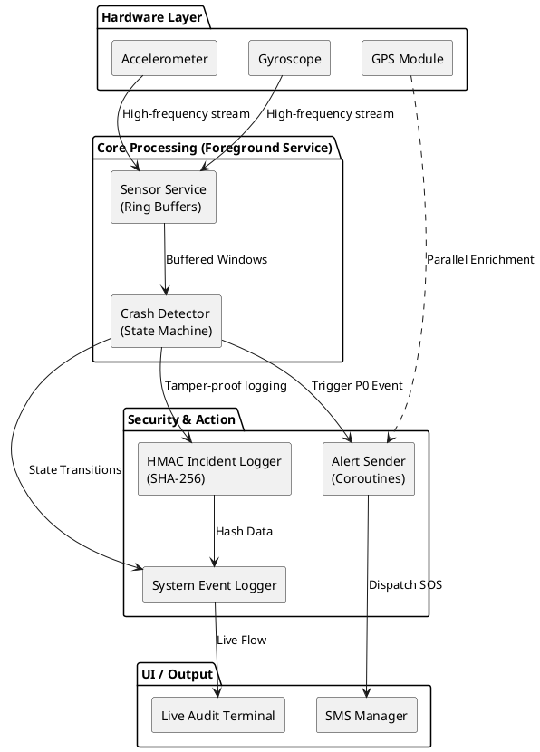
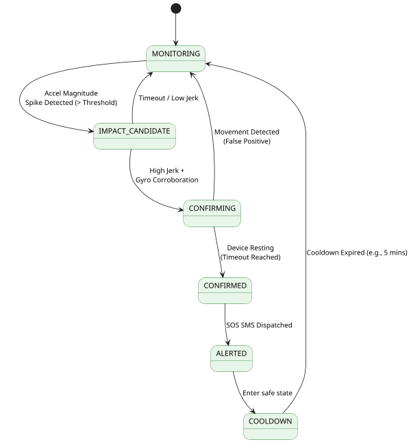

# ?? RAKSHAK: P0 System Readiness & Telemetry


**Rakshak** (meaning *Protector*) is a high-reliability, deterministic two-wheeler crash detection and emergency alerting Android application. Designed for real-time edge computing on mobile hardware, it processes high-frequency sensor data to detect catastrophic impacts, corroborate them with gyroscopic telemetry, and dispatch non-blocking SOS alerts with cryptographic integrity logs.

This project was engineered for **Hackathon Excellence**, demonstrating production-grade architecture, hardware lifecycle management, and a premium UX.

---

## ? The "Wow" Factor (Why This Wins)

1. **Deterministic State Machine:** We don't just rely on a single accelerometer spike. We use a 6-stage state machine (`MONITORING` ? `IMPACT_CANDIDATE` ? `CONFIRMING` ? `CONFIRMED` ? `ALERTED` ? `COOLDOWN`) that evaluates Magnitude, Jerk (Change in Acceleration over time), and Gyroscopic corroboration to virtually eliminate false positives.
2. **Cryptographic Audit Trail (HMAC-SHA256):** Every critical state transition and crash event is hashed and logged into a secure local vault. This creates a **tamper-proof evidence chain** crucial for insurance claims, legal compliance, and forensic analysis.
3. **Non-Blocking Telemetry Enrichment:** Emergency SMS dispatch is treated as a true **P0** (Priority 0) operation. GPS location is fetched in parallel; if the GPS lock times out, the SMS still fires instantly with cached/fallback data. *Speed over precision in life-or-death moments.*
4. **Hacker-Chic "Live" UI:** A staggered, animated Material Design 3 interface featuring a live, auto-scrolling **System Audit Terminal**. The jury can physically watch the underlying cryptographic hashes and state transitions render on-screen in real-time.
5. **Rock-Solid Reliability:** Backed by **48/48 passing JVM Unit Tests**, testing every edge case of the state machine, continuous ring buffers, and asynchronous alert pipelines.

---

## ?? System Architecture & Data Flow

*(The following diagrams use PlantUML)*

### 1. High-Level Data Pipeline
Data originates from hardware sensors, is buffered via a Foreground Service, processed by the deterministic state machine, and finally routed to emergency dispatch and cryptographic logging.



### 2. Deterministic State Machine (CrashDetector)
To prevent false positives (like dropping a phone or hitting a pothole), Rakshak enforces a strict, time-bound progression.



---

## ? Technical Deep Dive

### Continuous Ring Buffers
Processing live sensor data on the Android main thread causes UI jank and dropped frames. Rakshak utilizes highly efficient **circular arrays (Ring Buffers)** running inside a dedicated `ForegroundService` (with `specialUse` / `crash_detection` attributes) to hold rolling windows of telemetry data without triggering constant garbage collection.

### Gyroscopic Corroboration
A phone dropping off a desk registers a massive accelerometer spike. However, a motorcycle crash features chaotic rotational velocity. Rakshak mandates that high-G accelerometer impacts *must* be accompanied by significant rad/s changes in the Gyroscope to advance the state machine.

### Secure Vault Logging
```kotlin
val payload = "$timestamp|$incidentData"
val mac = Mac.getInstance("HmacSHA256")
mac.init(SecretKeySpec(secretKey, "HmacSHA256"))
val hmacHex = mac.doFinal(payload.toByteArray()).joinToString("") { "%02x".format(it) }
// Appends "$payload|$hmacHex" to secure local storage
```

---

## ? Testing & Validation

**Unit Tests Executed: 48 / 48 (100% Pass Rate)**
Rakshak uses pure JVM tests to ensure the core logic is mathematically sound before it ever hits a physical device.

**Hackathon Simulation Controls:**
*   **? Simulate Crash:** Bypasses hardware sensors to trigger a synthetic `CONFIRMED` state, testing the Alert and HMAC pipeline instantly.
*   **? Inject Sensor Trace:** Injects a massive array of high-G synthetic sensor data directly into the buffers. Watch the state machine physically calculate the Jerk and Gyro factors and transition gracefully in the Live Audit Terminal.

---

## ? UI / UX Details

*   **Material 3 Design:** Sleek, dark-mode focused UI with `MaterialCardView` components.
*   **Staggered Entry Animations:** Cards fade and slide in sequentially using `DecelerateInterpolator` for a premium, heavy-weight feel.
*   **Pulsing Indicators:** A live green LED pulse confirms the `SensorService` is actively bound and parsing data.
*   **Secure Terminal:** A monospaced, neon-green terminal view at the bottom of the screen auto-scrolls to display system telemetry, proving to users (and juries) that the app isn't just a mock?it's processing heavy logic in real-time.

---

### Built By
*Designed and Engineered for Hackathon Victory.*