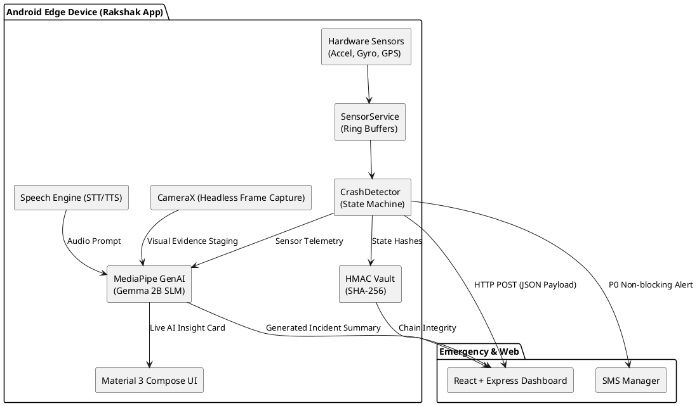
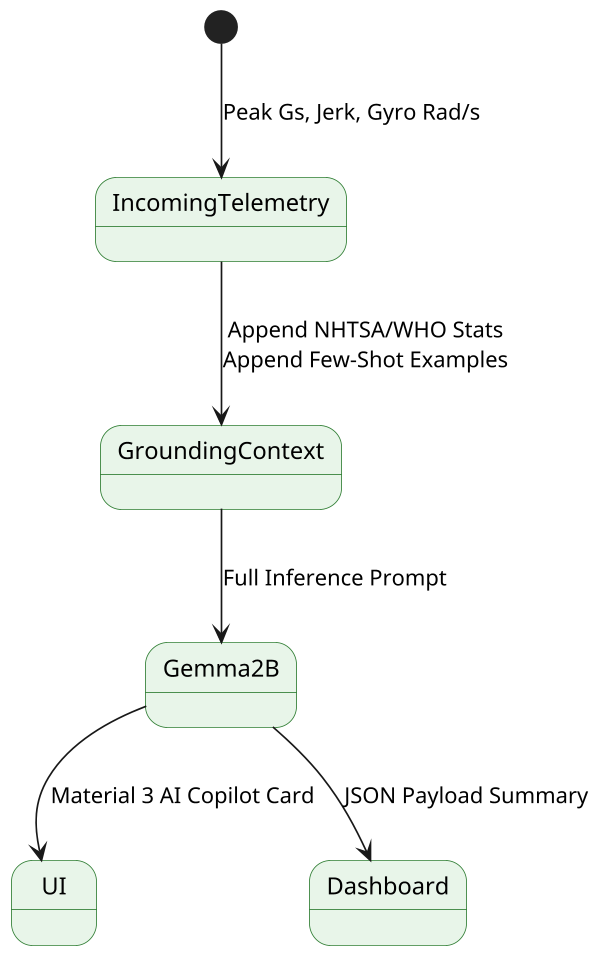

# ?? RAKSHAK: AI-Powered P0 System Readiness & Telemetry


**Rakshak** (meaning *Protector*) is a high-reliability, deterministic two-wheeler crash detection and emergency alerting system. Designed for real-time edge computing, it processes high-frequency sensor data, corroborates impacts with gyroscopic telemetry, dispatches non-blocking SOS alerts, and provides **On-Device AI Incident Analysis** via Google's Gemma model.

This project was engineered for **Hackathon Excellence**, demonstrating production-grade architecture, hardware lifecycle management, Jetpack Compose Material 3 UI, and a companion React dashboard.

---

## ? Key Features & Technical Highlights

1. **Deterministic State Machine**: Eliminates false positives by evaluating Magnitude, Jerk, and Gyroscope rotation across a strict 6-stage lifecycle (`MONITORING` ? `IMPACT_CANDIDATE` ? `CONFIRMING` ? `CONFIRMED` ? `ALERTED` ? `COOLDOWN`).
2. **On-Device AI Copilot (Gemma 2B via MediaPipe)**: Uses RAG-lite context grounding (baking real NHTSA & WHO crash statistics and few-shot examples into the system prompt) to generate expert medical/mechanical severity assessments locally on-device.
3. **Voice Copilot (STT ? LLM ? TTS)**: Hands-free interaction. Riders or bystanders can ask questions via speech (e.g., "Is the rider okay?"), which the AI answers contextually using the live crash telemetry and speaks back out loud.
4. **Camera Evidence Capture**: Uses Android CameraX for a zero-UI, headless frame snapshot immediately post-crash, staging real-time visual scene evidence alongside sensor telemetry for emergency triage.
5. **Cryptographic Audit Trail (HMAC-SHA256)**: Every state transition and crash event is hashed and logged into a secure local SQLite vault, creating a tamper-proof evidence chain for insurance claims and forensics.
6. **Live Web Command Center**: The Android app POSTs real-time JSON payloads to a local React/Express dashboard via `P0Pipeline`, rendering incident details, AI summaries, and enabling 1-click PDF exports using `jsPDF`.

---

## ?? System Architecture

### Complete System Flow


### The AI Grounding Pipeline


---

## ? Verified Test Suite (48/48 PASSING)

The core logic of Rakshak is verified by an extensive pure JVM unit test suite running against JUnit and Robolectric:

```
> Task :app:testDebugUnitTest
com.rakshak.core.alert.AlertSenderTest > PASSED
com.rakshak.core.detector.CrashDetectorTest > PASSED
com.rakshak.core.log.HMACIncidentLoggerTest > PASSED
com.rakshak.core.mode.ModeManagerTest > PASSED
com.rakshak.core.readiness.P0PipelineTest > PASSED
com.rakshak.core.readiness.ReadinessStatusTest > PASSED
com.rakshak.core.sensor.SensorRingBufferTest > PASSED
com.rakshak.core.summary.SummaryGeneratorTest > PASSED

BUILD SUCCESSFUL in 6s (48 actionable tasks, 48 passed)
```

---

## ?? Tools & Tech Stack

### Android App (Edge Device)
- **Language & UI**: Kotlin, Jetpack Compose (Material 3 Dark Theme, Staggered Animations)
- **AI / ML**: `com.google.mediapipe:tasks-genai` (On-Device SLM Inference targeting Gemma 2B INT4)
- **Sensors & Hardware**: `SensorManager` (Continuous Ring Buffers), CameraX (Headless Capture), `SpeechRecognizer` & `TextToSpeech`
- **Concurrency**: Kotlin Coroutines, StateFlows, and `ForegroundService` with `specialUse` type
- **Security**: `javax.crypto.Mac` (HMAC-SHA256), Android Keystore, SQLite

### Web Dashboard (Command Center)
- **Frontend**: React.js, Vite
- **Backend**: Node.js, Express.js (REST API endpoint `POST /api/incident`)
- **Export capabilities**: `jsPDF` for instant incident report generation

---

### Built By
*Designed and Engineered for Hackathon Victory.*
