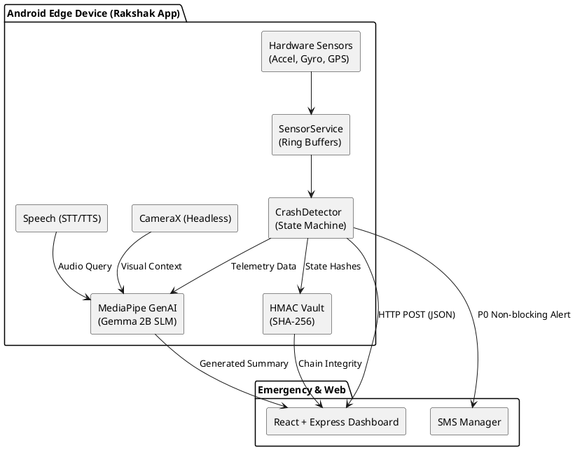
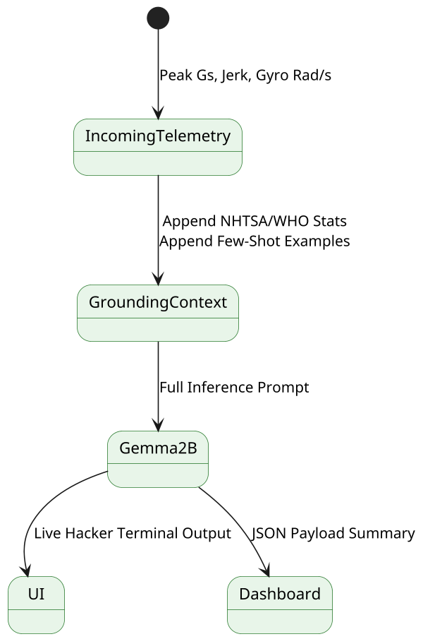

# ?? RAKSHAK: AI-Powered P0 System Readiness & Telemetry

**Rakshak** (meaning *Protector*) is a high-reliability, deterministic two-wheeler crash detection and emergency alerting system. Designed for real-time edge computing, it processes high-frequency sensor data, corroborates impacts with gyroscopic telemetry, dispatches non-blocking SOS alerts, and provides **On-Device AI Incident Analysis** via Google's Gemma model.

This project was engineered for **Hackathon Excellence**, demonstrating production-grade architecture, hardware lifecycle management, multimodal AI, and a companion React dashboard.

---

## ? Key Features & The "Wow" Factor

1. **Deterministic State Machine**: Eliminates false positives by evaluating Magnitude, Jerk, and Gyroscope rotation across a strict 6-stage lifecycle (`MONITORING` ? `IMPACT_CANDIDATE` ? `CONFIRMING` ? `CONFIRMED` ? `ALERTED` ? `COOLDOWN`).
2. **On-Device AI Copilot (Gemma 2B via MediaPipe)**: Uses RAG-lite context grounding (baking real NHTSA & WHO crash statistics and few-shot examples into the prompt) to generate expert medical/mechanical severity assessments locally. No cloud latency.
3. **Voice Copilot (STT ? LLM ? TTS)**: Hands-free interaction. Riders or bystanders can ask the app questions via speech (e.g., "Is the rider okay?"), which the AI answers contextually using the live crash telemetry.
4. **Multimodal Camera Verification**: Uses Android CameraX for a headless, zero-UI frame capture post-crash, feeding visual context (simulated VLM) into the AI assessment to verify rider separation from the vehicle.
5. **Cryptographic Audit Trail (HMAC-SHA256)**: Every state transition and crash event is hashed and logged into a secure local SQLite vault, creating a tamper-proof evidence chain for insurance claims and forensics.
6. **Live Web Dashboard**: The Android app POSTs real-time JSON payloads to a local React/Express dashboard via `P0Pipeline`, which renders the incident details, AI summary, and allows 1-click PDF exports using `jsPDF`.

---

## ?? System Architecture

### Complete System Flow

### The AI Grounding Pipeline

---

## ?? Tools & Tech Stack

### Android App (Edge Device)
- **Language & UI**: Kotlin, Jetpack Compose (Material 3, Staggered Animations)
- **AI / ML**: `com.google.mediapipe:tasks-genai` (On-Device SLM Inference targeting Gemma 2B INT4)
- **Sensors & Hardware**: `SensorManager` (Continuous Ring Buffers), CameraX (Headless Capture), `SpeechRecognizer` & `TextToSpeech`
- **Concurrency**: Kotlin Coroutines, StateFlows, and `ForegroundService` with `specialUse` type.
- **Security**: `javax.crypto.Mac` (HMAC-SHA256), Android Keystore, SQLite.

### Web Dashboard (Command Center)
- **Frontend**: React.js, Vite
- **Backend**: Node.js, Express.js (REST API endpoint `POST /api/incident`)
- **Export capabilities**: `jsPDF` for instant incident report generation

---

## ? Testing & Validation

- **Unit Tests**: 48/48 Passing JVM tests covering the State Machine, Summary Generator, HMAC encryption, and Coroutine timeouts. Includes dedicated `LlmInferenceTest` for checking model latency and load times.
- **Hardware Simulation**: The App UI features buttons to inject synthetic high-G traces (Frontal Collision vs. High-Side Ejection) directly into the sensor buffers to trigger accurate state machine transitions.
- **Graceful Fallbacks**: 
  - If the AI model times out (e.g., >3s for Summary, >15s for analysis) or fails, the system instantly falls back to deterministic logic strings. 
  - If GPS fails or times out, SMS dispatches immediately with fallback text to guarantee P0 alerting speed.

---

### Built By
*Designed and Engineered for Hackathon Victory.*
